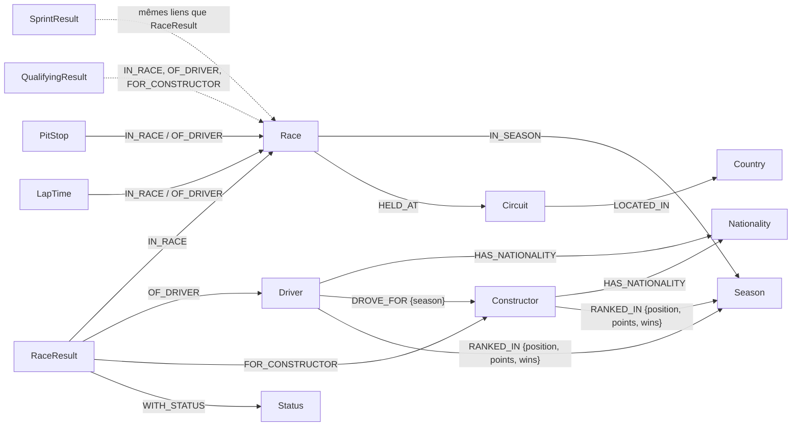

# Graphe F1 — Neo4j

Base de données graphe des Grands Prix de Formule 1 (1950 à aujourd'hui), alimentée
depuis l'API publique [Jolpica-F1](https://github.com/jolpica/jolpica-f1), successeur
compatible de l'API Ergast.

**Seul ce que la source permet d'alimenter est modélisé.** Pas d'étiquette ni de
relation « pour plus tard » : un type vide laisserait croire à une donnée absente.

## Modèle



| Nœud | Clé | Données | Disponible depuis |
|---|---|---|---|
| `Season` | `year` | | 1950 |
| `Circuit` | `circuitId` | nom, localité, `location` (point WGS-84) | |
| `Country` | `name` | libellé de l'API (`UK`, `USA`…), non normalisé | |
| `Nationality` | `name` | gentilé (`British`…) | |
| `Driver` | `driverId` | nom, trigramme, numéro permanent **actuel**, naissance | |
| `Constructor` | `constructorId` | nom | |
| `Status` | `name` | `Finished`, `+1 Lap`, `Engine`… | |
| `Race` | `raceId` (`AAAA-RR`), unique aussi sur `(season, round)` | date, heure UTC, horaires des séances | 1950 ; horaires selon les saisons |
| `RaceResult` | `resultId` (`AAAA-RR-numéro-pilote`) | grille, position, points, temps, meilleur tour | 1950 |
| `SprintResult` | `resultId` | idem, sans vitesse moyenne | 2021 |
| `QualifyingResult` | `resultId` | Q1, Q2, Q3 (texte et millisecondes) | partiel avant 2003 |
| `PitStop` | `pitStopId` (`AAAA-RR-pilote-arrêt`) | tour, heure locale, durée | 2011, avec `--arrets` |
| `LapTime` | `lapTimeId` (`AAAA-RR-pilote-tour`) | position, temps | 1996, avec `--tours` |

Le **numéro de voiture fait partie de la clé d'un résultat** : dans les années 1950,
un pilote peut courir deux voitures dans la même course, et deux pilotes partager une
voiture (même position). Ni `(course, pilote)` ni `(course, position)` ne sont uniques.

`DROVE_FOR` et `RANKED_IN` sont issus de la source (résultats, qualifications,
classements), pas d'une déduction : `RANKED_IN` est le classement **final**
(`afterRound` indique la manche ; pour la saison en cours, la dernière disputée).

### Ce qui n'est volontairement pas modélisé

- Les classements après chaque manche : une requête par manche et par championnat,
  soit environ 2 200 requêtes de plus (environ 4 h 30 au rythme autorisé).
- Le lien `Nationality` → `Country` : la source ne le fournit pas, le deviner serait inventer.
- L'historique des numéros permanents : l'API ne donne que le numéro actuel.

## Schéma

| Fichier | Contenu | Édition |
|---|---|---|
| [schema/01_contraintes.cypher](schema/01_contraintes.cypher) | 16 contraintes d'unicité (nœuds, composite, relations) | Community et Enterprise, ≥ 5.7 |
| [schema/02_contraintes_enterprise.cypher](schema/02_contraintes_enterprise.cypher) | 87 contraintes d'existence et de type | Enterprise ≥ 5.9 |
| [schema/03_index.cypher](schema/03_index.cypher) | index range, point et plein texte (insensible aux accents) | ≥ 5.7 |
| [schema/04_requetes.cypher](schema/04_requetes.cypher) | requêtes de référence, une par index | documentation |

Sur Community, ce que Neo4j ne sait pas imposer (existence, cardinalité des relations)
est vérifié après chaque chargement par `charger.py`, qui se termine en erreur si un
invariant est violé.

### Neo4j Community : une seule base utilisateur

Community refuse `CREATE DATABASE` : le graphe F1 se charge alors dans la base `neo4j`,
éventuellement à côté d'autres graphes. C'est sans risque pour eux : le chargement ne
fait que des `MERGE` sur les étiquettes du modèle, et `--vider` n'efface que ces
étiquettes (liste `LABELS` de `charger.py`), jamais le reste de la base.

Essai de référence : Neo4j 2026.08.1 Community. Les 12 requêtes de
`04_requetes.cypher` y ont été profilées, et chacune emprunte l'index prévu.

## Utilisation

Prérequis : Python ≥ 3.11, Neo4j ≥ 5.7 (5.26 LTS ou 2025.x conseillés).

```bash
python -m venv .venv
```

```bash
.venv/Scripts/python -m pip install -r requirements.txt
```

```bash
cp .env.example .env
```

1. **Extraire** vers le cache local `donnees/brut/` (rien n'est écrit dans Neo4j) :

   ```bash
   .venv/Scripts/python extraire.py
   ```

   Options : `--de 2011 --a 2024`, `--arrets` (arrêts au stand), `--tours` (temps au
   tour, environ 15 requêtes par course), `--forcer`. L'API limite à 500 requêtes par
   heure : l'extraction complète de base en demande environ 700, le script temporise
   seul et reprend là où il s'était arrêté.

2. **Charger** (schéma, puis données, puis contrôles) :

   ```bash
   .venv/Scripts/python charger.py
   ```

   La transformation et la validation se font **avant** toute écriture : une donnée
   illisible ou une clé en double interrompt tout, sans charger à moitié.

3. **Tracer la provenance** :

   ```bash
   .venv/Scripts/python manifeste.py
   ```

`python transformer.py` valide le cache seul, sans Neo4j.

## Données et licence

Les données Jolpica-F1 sont sous licence **CC BY-NC-SA 4.0** : usage non commercial,
attribution, partage dans les mêmes conditions. Elles ne sont **jamais versionnées**
(`donnees/` est exclu par `.gitignore`). [SOURCES.md](SOURCES.md), généré, en donne
la provenance, la licence relue dans les conditions de l'éditeur, et l'empreinte
SHA-256 de chaque réponse.
